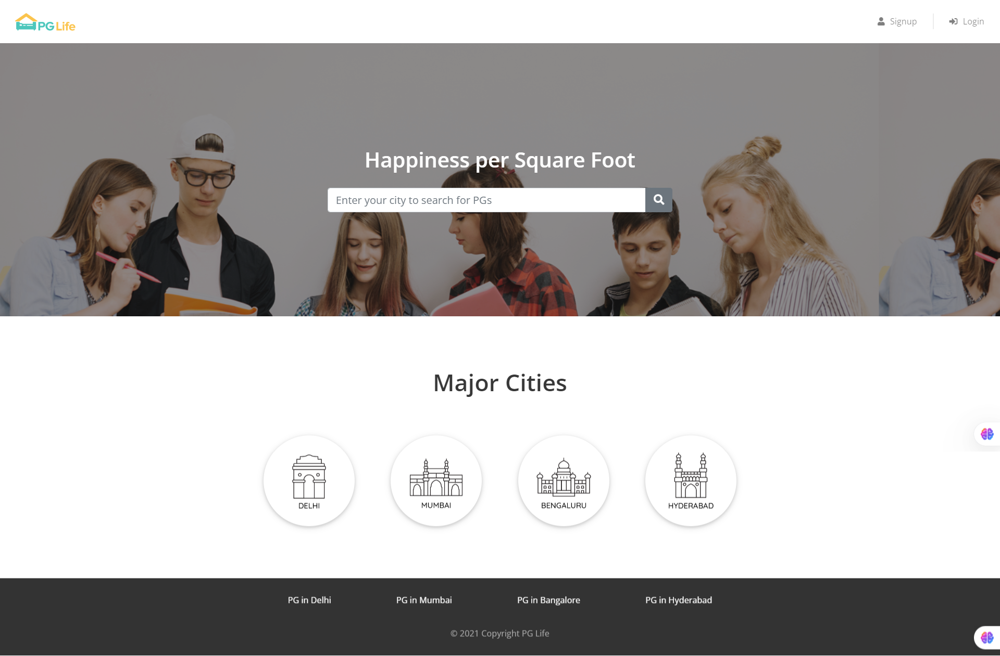

# PG Life

**PG Life** is a platform for managing paying guest accommodations. It helps users find, book, and manage their stay in PGs (Paying Guests) with features like room booking, payment tracking, and amenities management.

## Demo



## Features

- **Room Booking**: Users can browse and book rooms in PGs based on availability.
- **Payment Management**: Track payments and generate receipts.
- **Amenities Management**: View available amenities like Wi-Fi, meals, laundry, etc.
- **Profile Management**: Users can update their personal information, preferences, and check-in/check-out dates.
- **PG Search**: Search for PGs based on location, price, and amenities.
- **Admin Panel**: Admins can add PG details, update availability, and manage users.

## Technologies Used

### Backend:
- **PHP**: Server-side scripting language for handling requests and logic.
- **MySQL**: Relational database to store user data, PG details, room bookings, payments, etc.
- **PHPMyAdmin**: For easy management of MySQL databases.

### Frontend:
- **React.js**: JavaScript library for building the user interface.
- **CSS/Bootstrap/Tailwind CSS**: For styling the pages.

### APIs:
- Custom API built using **PHP** to manage user authentication, bookings, payments, etc.

## Installation

To run this project locally, follow these steps:

### 1. Clone the repository:
```bash
git clone https://github.com/yourusername/pg-life.git
